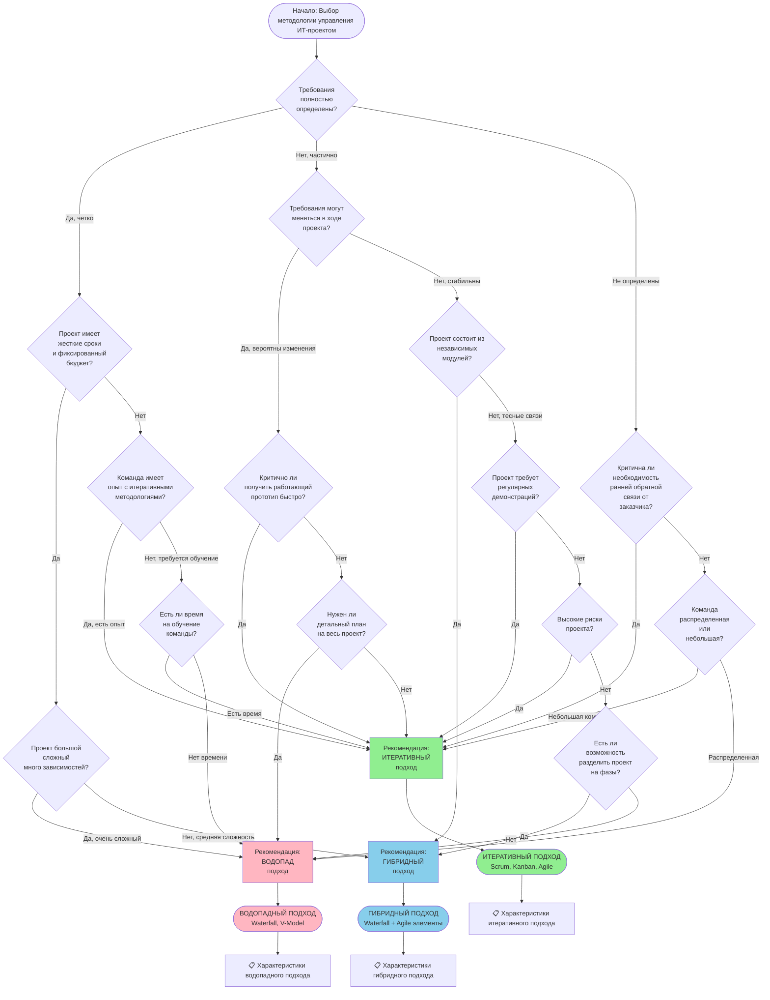

# Методика выбора подхода управления ИТ-проектом

**Версия:** 1.0  
**Дата:** 2024  
**Назначение:** Блок-схема для выбора между водопадным, итеративным или гибридным подходом

---

## Блок-схема выбора методологии

---

## Описание подходов

### 🔵 Водопадный подход (Waterfall)

**Когда использовать:**
- ✅ Требования полностью определены и стабильны
- ✅ Проект имеет жесткие сроки и фиксированный бюджет
- ✅ Проект большой и сложный с множеством зависимостей
- ✅ Команда не имеет опыта с итеративными методологиями
- ✅ Проект требует детального плана на весь период
- ✅ Высокая документация критична для проекта
- ✅ Распределенная команда без опыта Agile

**Преимущества:**
- Четкая структура и этапы
- Легко контролировать прогресс
- Подробная документация на каждом этапе
- Подходит для больших команд
- Минимизирует риски при четких требованиях

**Недостатки:**
- Сложно вносить изменения после начала этапа
- Позднее получение обратной связи
- Высокие риски при неопределенных требованиях
- Долгая разработка до получения результата

**Типичные этапы:**
1. Сбор и анализ требований
2. Проектирование
3. Реализация
4. Тестирование
5. Развертывание
6. Поддержка

---

### 🟢 Итеративный подход (Agile/Scrum/Kanban)

**Когда использовать:**
- ✅ Требования частично определены или могут меняться
- ✅ Критична необходимость ранней обратной связи
- ✅ Нужно быстро получить работающий прототип
- ✅ Команда имеет опыт с итеративными методологиями
- ✅ Проект требует регулярных демонстраций заказчику
- ✅ Высокие риски проекта (необходима быстрая валидация)
- ✅ Небольшая координированная команда

**Преимущества:**
- Гибкость к изменениям требований
- Ранняя обратная связь от заказчика
- Быстрое получение работающих версий
- Возможность адаптации к новым требованиям
- Лучшая мотивация команды (видимый прогресс)

**Недостатки:**
- Требует активного участия заказчика
- Может быть сложнее контролировать бюджет
- Меньше формальной документации
- Требует опытной команды
- Может быть сложнее для больших распределенных команд

**Типичные практики:**
- Короткие спринты (1-4 недели)
- Ежедневные стендапы
- Ретроспективы после каждого спринта
- Backlog приоритизации
- Непрерывная интеграция и доставка

---

### 🔷 Гибридный подход (Hybrid)

**Когда использовать:**
- ✅ Проект состоит из независимых модулей
- ✅ Часть требований четко определена, часть может меняться
- ✅ Средняя сложность проекта
- ✅ Есть возможность разделить проект на фазы
- ✅ Разные модули требуют разных подходов
- ✅ Необходим баланс между контролем и гибкостью

**Преимущества:**
- Сочетает преимущества обоих подходов
- Гибкость там, где нужно, контроль там, где важно
- Можно применять разные методологии к разным частям проекта
- Подходит для проектов средней сложности
- Балансирует риски и гибкость

**Недостатки:**
- Требует четкого планирования, какие части каким подходом
- Может быть сложнее в управлении
- Команда должна понимать оба подхода
- Требует опытного менеджера проекта

**Типичная структура:**
- **Водопад** для: архитектуры, критической инфраструктуры, стабильных модулей
- **Итерации** для: функциональных модулей, UI/UX, модулей с неопределенными требованиями

---

## Критерии выбора

### Таблица сравнения критериев

| Критерий | Водопад | Итерации | Гибрид |
|----------|---------|----------|--------|
| **Четкость требований** | Полностью определены | Частично/не определены | Смешанные |
| **Размер проекта** | Большой | Малый-средний | Средний-большой |
| **Сроки** | Жесткие, фиксированные | Гибкие | Частично фиксированные |
| **Бюджет** | Фиксированный | Гибкий | Частично фиксированный |
| **Риски** | Низкие | Высокие | Средние |
| **Опыт команды** | Любой | Требуется Agile опыт | Смешанный |
| **Обратная связь** | В конце проекта | Непрерывная | Периодическая |
| **Изменения требований** | Минимальные | Частые | Умеренные |
| **Документация** | Обязательная | Минимальная | Избирательная |
| **Участие заказчика** | Минимальное | Активное | Умеренное |

---

## Рекомендации по применению

### Для данного проекта (Licensing Portal)

**Анализ проекта:**

1. **Требования:** Частично определены, возможны изменения
2. **Размер:** Средний проект
3. **Команда:** Небольшая (1-2 backend, 1-2 frontend)
4. **Сроки:** Средние, есть гибкость
5. **Риски:** Средние (интеграции с внешними системами)

**Рекомендация: 🟢 ИТЕРАТИВНЫЙ ПОДХОД (Agile/Scrum)**

**Обоснование:**
- Требования могут уточняться в процессе разработки
- Критична обратная связь для UI/UX
- Возможность демонстрировать прогресс по модулям
- Интеграции с ЕГРН, ГИС требуют итеративного подхода для отладки
- Небольшая команда подходит для Agile

**Структура итераций:**
- **Итерация 1 (2 недели):** Базовая аутентификация + структура БД
- **Итерация 2 (2 недели):** Модуль магазинов (Stores)
- **Итерация 3 (2 недели):** Модуль платежей (Payments)
- **Итерация 4 (2 недели):** Модуль документов (Documents)
- **Итерация 5 (2 недели):** Интеграции (ЕГРН, ГИС)
- **Итерация 6 (2 недели):** Дашборд и аналитика
- **Итерация 7 (2 недели):** Тестирование и оптимизация

---

## Дополнительные соображения

### Факторы, влияющие на выбор

1. **Организационная культура**
   - Гибкая, открытая к изменениям → Итерации
   - Консервативная, формальная → Водопад
   - Смешанная → Гибрид

2. **Отрасль и регулятивные требования**
   - Высокие требования к документации → Водопад/Гибрид
   - Стандартные требования → Итерации

3. **Размер и опыт команды**
   - Опытная небольшая команда → Итерации
   - Большая команда без Agile опыта → Водопад
   - Смешанная команда → Гибрид

4. **Характер продукта**
   - Инновационный продукт → Итерации
   - Типовой продукт → Водопад
   - Продукт с модульной структурой → Гибрид

---

## Заключение

Выбор методологии управления проектом — критически важное решение, которое влияет на успех проекта. Используйте данную блок-схему как инструмент для принятия решения, но всегда адаптируйте подход под специфику вашего проекта, команды и организации.

**Помните:**
- Методология — это инструмент, а не цель
- Возможно комбинирование элементов разных подходов
- Методология должна служить команде, а не наоборот
- Будьте готовы адаптировать подход по ходу проекта

---

**Документ подготовлен:** 2024  
**Версия:** 1.0

